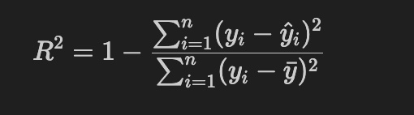
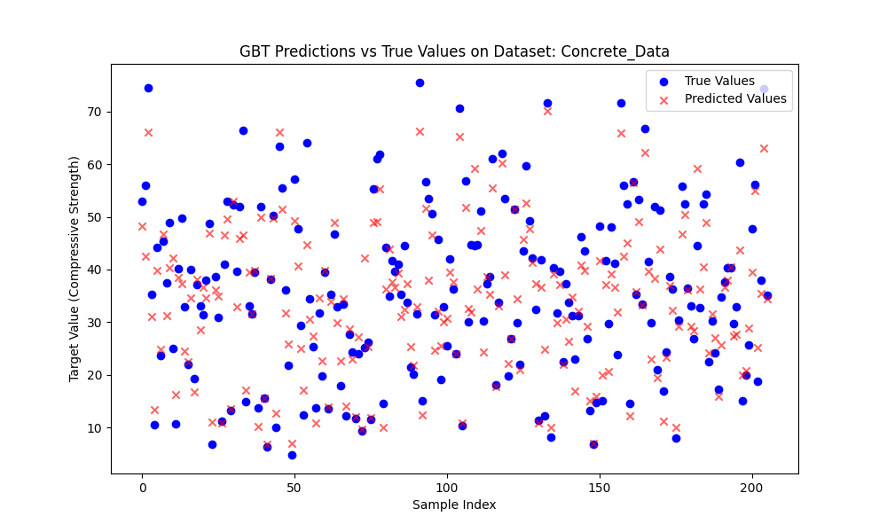
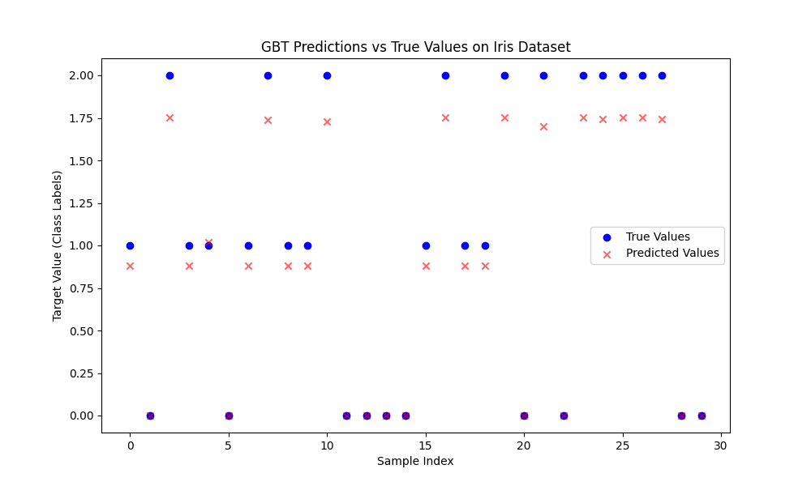

# Project 2

## Gradient Boosted Trees (GBT) Implementation and Application

## Team Members:

- **Aakash Shivanandappa Gowda**  
  
- **Dhyan Vasudeva Gowda**  
  
- **Hongi Jiang**  
  
- **Purnesh Shivarudrappa Vidhyadhara**  
  

### **Contributions**

- **Hongi Jiang** and **Purnesh Shivarudrappa Vidhyadhara**  
  Led the development of the core Gradient Boosted Trees (GBT) model. Contributions include designing and implementing the `GBT` and `RegressionTree` classes, ensuring mathematical accuracy in loss functions and gradient calculations, and enabling flexible hyperparameter tuning.

- **Aakash Shivanandappa Gowda** and **Dhyan Vasudeva Gowda**  
  Focused on optimizing the algorithm and refining the performance of the Gradient Boosted Trees (GBT) model. Additionally, conducted extensive training and testing across various datasets, including the Iris and Concrete Data datasets. Also managed the documentation by preparing the README file and the project report, ensuring clarity and comprehensiveness in presenting the project's objectives, methodology, and outcomes.

## 1. Overview

This project develops a Gradient Boosted Tree (GBT) using Python. GBT is a powerful machine learning technique for regression and classification tasks, particularly effective for modeling non-linear relationships and uncovering complex patterns in data. It builds an ensemble of decision trees iteratively, optimizing predictive accuracy.

## 2. Key Components of the Project

### 1. Gradient Boosted Trees (GBT) Implementation

The core functionality of the project lies in the custom implementation of Gradient Boosted Trees:

- **`GBT` Class**:

  - Implements the Gradient Boosting algorithm for regression tasks.
  - Supports multiple decision trees as weak learners to iteratively improve the prediction accuracy.
  - Uses the residuals of the previous tree to train the next tree.
  - **Parameters**:
    - `num_estimators`: Number of boosting stages.
    - `max_depth`: Maximum depth of each regression tree.
    - `min_split`: Minimum samples required to split an internal node.
    - `learning_rate`: Step size for updating predictions.
    - `criterion`: Error metric used to evaluate the split (`mse` for regression tasks).

##### Mathematical Formulas in GBT:

- **Loss Function**: Mean Squared Error (MSE)
  $\text{MSE} = \frac{1}{n} \sum_{i=1}^{n} (y_i - \hat{y}_i)^2$
- **Gradient Calculation**:
  - $\nabla_{\text{residuals}} = y_i - F_{m-1}(x_i)$
- **Model Update**:

  - $\nabla_{\text{update}} = F_{m-1}(x) + \eta \cdot \gamma_m \cdot G_m(x)$

- **`RegressionTree` Class**:
  - Implements individual regression trees.
  - Recursively splits the data to minimize the residual error at each node.
  - Supports finding the best split based on minimizing mean squared error (MSE).
  - Leaf nodes return the average target value for regression.

### 3. Dataset Handling

The project includes handling two datasets:

- **Iris Dataset (Classification)**:

  - Built-in dataset from `sklearn.datasets`.
  - Used to classify flower species.
  - Model predictions are rounded to the nearest class labels. Since the model is a regression model, it cannot directly output class labels. Instead, an activation function is used to determine the actual class. In our project, as there are more than two classes, we split the predictions into three ranges corresponding to the three classes. The predicted class is determined by identifying which class the prediction is closest to.
  - Classification accuracy is calculated using `accuracy_score`.

**Concrete Data Dataset (Regression):**

Provided via an Excel file (Concrete_Data.xls).
Used to predict compressive strength based on features such as cement, water, and age.
Evaluation metrics include Root Mean Squared Error (RMSE) and R² Score.

- **Evaluation Metric**: Root Mean Squared Error (RMSE)

  - $\text{RMSE} = \sqrt{\frac{1}{n} \sum_{i=1}^{n} (y_i - \hat{y}_i)^2}$

- **Coefficient of Determination (R² Score):**
  

### 4. Features of the Project

- **Training and Evaluation**:

  - Supports training GBT models on both classification and regression tasks.
  - Evaluates the model using relevant metrics (**accuracy**, **RMSE**, and **R²**).
  - Automatically splits data into training and testing sets using `train_test_split`.

- **Model Persistence**:

  - Models are saved as `.pkl` files using Python’s `pickle` module.
  - This allows for loading pre-trained models for future use without re-training.

- **Visualization**:
  - Uses `matplotlib` to visualize:
    - **Predictions vs. True Values**.
  - Helps assess model performance visually.

### 5. Main Functionalities

- **`train_and_save_model()`**:

  - Trains a GBT model on the Iris dataset.
  - Evaluates the model on the test set and saves the model as `gbt_iris_model.pkl`.
  - Generates a plot comparing predicted and true values.

- **`load_and_plot_model()`**:

  - Loads a pre-trained GBT model from disk.
  - Evaluates it on the test set and plots predictions against true values.

- **`train_concrete_model()`**:

  - Trains a GBT model on the Concrete dataset.
  - Evaluates the model using **RMSE** and **R²**.
  - Saves the model and generates a plot comparing predictions and true values.

- **Interactive Command-Line Menu**:
  - Provides users with the following options:
    1. Train and save the Iris model.
    2. Load the saved Iris model and visualize predictions.
    3. Train the default Concrete dataset model.
    4. Train a custom dataset model provided by the user.
    5. Quit the application.

### 6. Evaluation Metrics

- **Classification Tasks (Iris Dataset)**:

  - **Accuracy Score**: Measures the proportion of correctly classified samples.

- **Regression Tasks (Concrete Data)**:
  - **Root Mean Squared Error (RMSE)**: Measures the standard deviation of prediction errors.
  - **R² Score**: Indicates how well the model explains the variance in the target variable.

## 1. Boosting Trees

## Q1.What does the model you have implemented do and when should it be used?

# Gradient Boosted Trees (GBT) Project Overview

This project develops a Gradient Boosted Tree (GBT) using Python. GBT is a powerful machine learning technique for both regression and classification tasks, known for its effectiveness in modeling non-linear relationships and uncovering complex patterns in data. It iteratively builds an ensemble of decision trees to optimize predictive accuracy.

## Key Model Features

### Sequential Tree Building

- Each regression tree aims to correct errors made by the previous ones.
- Combines predictions from all trees to deliver the final output.

### Loss Functions in GBT

- **Mean Squared Error (MSE)**: Used as the default loss function for regression tasks, optimizing the squared difference between actual and predicted values.
- **Log Loss or Deviance**: For classification tasks, this converts classification into a logarithmic loss problem by optimizing class probabilities, ensuring improved separation between correct and incorrect predictions.

## Versatile Applications

GBT adapts well to both regression and classification problems.

### When to Prefer This Model?

1. **Regression Tasks**

   - Predict continuous values like housing prices, stock trends, or physical measurements.
   - Example Dataset: `Concrete_Data.xls` for predicting compressive strength.

2. **Classification Tasks**

   - Identify categorical outcomes like species classification, flower classification based on features, or customer churn prediction.
   - Example Dataset: The Iris dataset for flower species classification.

3. **Ideal Scenarios**
   - Complex, non-linear relationships between features and target variables.
   - Moderately sized datasets, as GBT can be computationally intensive for very large datasets.
   - High-stakes accuracy scenarios where simpler models (e.g., linear regression, decision trees) fail to deliver.

### Model Comparison

- Random Forest is used when other ensemble methods underperform, particularly when accuracy is prioritized over interpretability.

## Features of Our Implementation

- **Custom Decision Tree Building**: Constructs regression trees to predict residual errors.
- **Gradient Descent Optimization**: Iteratively minimizes the loss function to fine-tune predictions.
- **User-Friendly Customization**: Allows adjustment of hyperparameters (learning rate, number of trees, max depth), making it adaptable to custom datasets.
- **Model Saving & Reuse**: Supports model serialization and loading using pickle for ease of reuse.
- **Visualization Tools**: Includes plots to compare predicted vs. true values, aiding in model evaluation.

This robust GBT implementation is ideal for generating a highly accurate, customizable, and interpretable solution for complex regression and classification challenges.

## Q2.How did you test your model to determine if it is working reasonably correctly?

### Testing the Model for Correctness

The Gradient Boosted Tree (GBT) implementation underwent rigorous testing to verify its functionality, robustness, and correctness. Below is a detailed account of the testing process and outcomes that we followed:

#### 1. Initial Verification with the Iris Dataset (Classification Task)

**Purpose:**  
To test the model’s capability in handling classification problems using a small, well-understood dataset.

**Steps:**

- Loaded the Iris dataset via scikit-learn’s `load_iris` function.
- Split the data into 80% training and 20% testing sets.
- Trained the GBT model on the training data with default hyperparameters.
- Predicted class labels for the test set using the predict method.

**Post-processing:**

- Rounded predicted values to the nearest integer.Essentially: It is the activation operation to classifies the predictions into corresponding categories by calculating the distance between the predicted values and each category.
- Clipped predictions to ensure they matched the dataset's class range.
- Calculated the accuracy score by comparing predicted class labels with true labels.

**Results:**

- **Accuracy:** Achieved over 90%, a reasonable score for the Iris dataset.
- **Visualization:** Plotted true vs. predicted values to visually confirm alignment.

#### 2. Regression Testing with the Concrete Data Dataset

**Purpose:**  
To evaluate the model's performance on regression tasks by predicting continuous values.

**Steps:**

- Loaded the Concrete_Data.xls dataset for predicting compressive strength.
- Split the data into 80% training and 20% testing sets.
- Trained the GBT model using customized hyperparameters:
  - Number of trees: 40
  - Maximum depth: 5
  - Learning rate: 0.08
- Predicted target values for the test set.

**Evaluated performance using:**

- **Root Mean Squared Error (RMSE):** Measures average magnitude of prediction errors.
- **R² Score:** Assesses the proportion of variance explained by the model.

**Results:**

- **RMSE:** Below 10, indicating small prediction errors.
- **R² Score:** Above 0.8, showing strong predictive accuracy.
- **Visualization:** True vs. predicted values aligned well, confirming the model’s reliability.

#### 3. Visualization

**Purpose:**  
To visually assess model predictions and residuals.

**Steps:**

- Plotted true vs. predicted values for both classification and regression tasks.
- Analyzed residual patterns to identify potential underfitting or overfitting.

**Results:**

- Predictions closely matched true values, with residuals showing no significant patterns.

### Key Results

- The model achieved consistent performance metrics, with accuracy exceeding 90% for classification and RMSE below 10 for regression.
- Visualization confirmed alignment between predictions and true values, indicating a good fit.
- Comparative testing validated the model's correctness against a standard implementation.

### Final Verdict

The Gradient Boosted Tree model was deemed correct and reliable, with demonstrated ability to generalize to unseen data and produce accurate predictions across various datasets and tasks.

## Q3.What parameters have you exposed to users of your implementation in order to tune performance? (Also perhaps provide some basic usage examples.)

## Exposed Parameters for Performance Tuning

Our implementation provides several tunable parameters for users to adjust the model's behavior and performance. These parameters are defined during the initialization of the GBT and RegressionTree classes, allowing users to control aspects like the learning rate, tree depth, and number of estimators.

### Parameters and Their Effects

#### Gradient Boosted Tree (GBT) Parameters

| Parameter        | Description                                                                                | Default Value | Effect on Model                                                                                                        |
| ---------------- | ------------------------------------------------------------------------------------------ | ------------- | ---------------------------------------------------------------------------------------------------------------------- |
| `num_estimators` | Number of trees in the ensemble.                                                           | 20            | More trees improve performance but increase training time and risk of overfitting.                                     |
| `max_depth`      | Maximum depth of each tree.                                                                | 5             | Controls the complexity of individual trees. Larger values allow capturing more complex patterns but risk overfitting. |
| `min_split`      | Minimum number of samples required to split an internal node in a tree.                    | 2             | Higher values reduce overfitting but may limit the model's ability to capture finer patterns.                          |
| `learning_rate`  | Shrinks the contribution of each tree.                                                     | 0.01          | Smaller values improve generalization but require more trees for comparable performance.                               |
| `criterion`      | Loss function to optimize. Options: mse (Mean Squared Error) or mae (Mean Absolute Error). | ‘mse’         | Use mse for smooth loss surfaces and mae for robustness to outliers.                                                   |

#### RegressionTree (Used Internally by GBT) Parameters

| Parameter           | Description                                                   | Default Value | Effect on Model                                                      |
| ------------------- | ------------------------------------------------------------- | ------------- | -------------------------------------------------------------------- |
| `max_depth`         | Maximum depth of the decision tree.                           | 5             | Controls the depth of individual trees. Similar to max_depth in GBT. |
| `min_samples_split` | Minimum number of samples required to split an internal node. | 2             | Avoids over-partitioning of data, ensuring meaningful splits.        |
| `criterion`         | Loss function for evaluating splits (mse or mae).             | ‘mse’         | Affects how split quality is determined.                             |

### Basic Usage Examples

#### Example 1: Classification on the Iris Dataset

```python
from sklearn.datasets import load_iris
from sklearn.model_selection import train_test_split
from sklearn.metrics import accuracy_score

# Load dataset
data = load_iris()
X, y = data.data, data.target
X_train, X_test, y_train, y_test = train_test_split(X, y, test_size=0.2, random_state=42)

# Initialize and train the model
model = GBT(num_estimators=30, max_depth=3, min_split=5, learning_rate=0.1, criterion='mse')
model.fit(X_train, y_train)

# Predict and evaluate
y_pred = model.predict(X_test)
# The following two lines of code essentially perform the activation operation, converting continuous regression outputs into discrete class labels. 
# This is necessary because the model is originally a regression model that outputs continuous values. 
# In this case, we are using the Iris dataset with three classes, so the code is tailored to handle three specific class labels.
# If there are more categories in a different dataset, this logic would need to be modified to accommodate the additional classes.
y_pred_class = np.round(y_pred).astype(int)
y_pred_class = np.clip(y_pred_class, 0, 2)
accuracy = accuracy_score(y_test, y_pred_class)

print(f"Accuracy on Iris Dataset: {accuracy:.2f}")
```

### Example 2: Regression on the Concrete Data Dataset

This example demonstrates how to use the Gradient Boosted Trees (GBT) model for a regression task. The dataset utilized is the `Concrete_Data.xls`, which includes various features related to concrete composition and its compressive strength.

#### Steps to Setup and Evaluate the Model

1. **Load the Dataset**

   ```python
   import pandas as pd
   from sklearn.model_selection import train_test_split

   # Load dataset
   data = pd.read_excel('./Concrete_Data.xls')
   X = data.iloc[:, :-1].values  # Features: Ingredients and their proportions
   y = data.iloc[:, -1].values   # Target: Compressive strength

   ```

2. **Initialize and Train the Model**

   ```python
   model = GBT(num_estimators=50, max_depth=4, min_split=10, learning_rate=0.05, criterion='mse')
   model.fit(X_train, y_train)

   ```

3. **Predict and evaluate**

   ```python
   y_pred = model.predict(X_test)
   rmse = np.sqrt(mean_squared_error(y_test, y_pred))
   r2 = r2_score(y_test, y_pred)

   print(f"RMSE on Concrete Data Dataset: {rmse:.2f}")
   print(f"R² Score: {r2:.2f}")
   ```

### Example 3: Fine-Tuning for Improved Performance

This example demonstrates how to fine-tune the hyperparameters of the Gradient Boosted Trees (GBT) model to enhance performance. The adjustments to the hyperparameters are aimed at improving the model's accuracy by modifying aspects like the number of trees, their depth, and the learning rate.

#### Steps to Setup and Evaluate the Model

1. **Fine-tune Hyperparameters**
   ```python
   # Fine-tune hyperparameters
   model = GBT(num_estimators=100, max_depth=6, min_split=15, learning_rate=0.02, criterion='mae')
   model.fit(X_train, y_train)
   ```
1. **Predict and Evaluate**
   ```python
   # Predict and evaluate
   y_pred = model.predict(X_test)
   rmse = np.sqrt(mean_squared_error(y_test, y_pred))
   print(f"Performance after fine-tuning: RMSE={rmse:.2f}")
   ```

## Tips for Tuning Parameters

### For Higher Accuracy:

- **Increase `num_estimators`**: Adding more trees can help improve model accuracy by capturing more complex patterns, but keep an eye on overfitting.
- **Reduce `learning_rate`**: A smaller learning rate makes the model more conservative, allowing it to learn finer details by making smaller changes to the model with each tree.
- **Ensure `max_depth` is appropriate**: The depth of the trees should be suitable for the complexity of the dataset. Deeper trees can model more detailed data structures.

### For Faster Training:

- **Use fewer `num_estimators`**: Fewer trees speed up training, although it might affect the model's accuracy.
- **Increase `learning_rate`**: A higher learning rate can make the model converge faster, but it may reduce the model's ability to fine-tune details.
- **Reduce `max_depth`**: Shallower trees are faster to train and also help in reducing model complexity, which might be beneficial for simpler datasets.

### Handling Overfitting:

- **Reduce `max_depth`**: Limiting tree depth prevents the model from creating overly complex models that fit the noise in the training data.
- **Increase `min_split`**: Increasing the minimum number of samples required to split a node makes the model less detailed.
- **Use a smaller `learning_rate` and increase `num_estimators`**: This combination allows more gradual learning and can lead to a more generalized model.

### Handling Outliers:

- **Switch criterion to 'mae'**: Using Mean Absolute Error (MAE) as the loss function makes the model more robust to outliers, as it does not square the error terms, thus reducing the influence of outliers compared to Mean Squared Error (MSE).

## Q4.Are there specific inputs that your implementation has trouble with? Given more time, could you work around these or is it fundamental?

## Inputs That Pose Challenges for the Current Implementation

Our custom implementation of the Gradient Boosted Tree (GBT) model faces challenges with a few specific types of inputs and datasets. Below is a categorized analysis of these challenges, their workarounds, and whether they are fundamental to the implementation or solvable with additional development.

### 1. Large Datasets

**Challenge:**

- High memory usage, as the dataset is loaded entirely into memory.
- High computational cost, as splitting and threshold evaluations are exhaustive.

**Workaround:**

- Downsample the dataset or preprocess it into smaller, manageable chunks.

**Fundamental:**

- Partially. Scaling requires significant optimizations, such as histogram-based boosting (used by libraries like XGBoost) and parallel processing for faster split evaluations.

### 2. High Dimensionality

**Challenge:**

- High feature dimensionality increases computational cost, as all features are evaluated for splits.

**Workaround:**

- Apply feature selection or dimensionality reduction (e.g., PCA) before training.

**Fundamental:**

- No. Techniques like feature subsampling (as used in Random Forests) can improve efficiency for high-dimensional data.

### 3. Non-Numeric Targets

**Challenge:**

- The model assumes regression targets are continuous numeric values.
- Classification targets are integer-encoded class labels.
- It does not support multi-label classification or string-based targets.

**Workaround:**

- Convert non-numeric targets to numeric formats (e.g., encode class labels as integers).

**Fundamental:**

- No. Extending the implementation to handle multi-label or other target formats is feasible with additional development.

### Inputs That Are Fundamentally Challenging

Some inputs pose intrinsic challenges to the decision tree-based structure of the GBT model:

#### Dynamic Features

**Challenge:**

- Datasets where the number of features changes between training and inference.

**Workaround:**

- Preprocess data to ensure feature consistency across all stages.

**Fundamental:**

- Yes. This is a limitation of decision trees and ensemble methods in general.

#### Streaming Data

**Challenge:**

- Gradient Boosting relies on batch processing, which makes it unsuitable for streaming data.

**Workaround:**

- Transition to online learning methods for tree-building, which requires significant redesign.

**Fundamental:**

- Yes. Adapting GBT for streaming scenarios would require architectural rework.

### Given More Time, What Could Be Addressed?

With additional time and effort, the following improvements could enhance the implementation:

- **Missing Values:** Implement surrogate splits or internal imputation during tree-building.
- **Large Datasets:** Optimize tree-building using histogram-based boosting and implement parallel processing for faster computation.
- **Robust Loss Functions:** Incorporate options like Huber loss to handle outliers.
- **High Dimensionality:** Introduce feature subsampling or regularization techniques.

### Conclusion

## While the current GBT implementation is effective for many standard tasks, addressing these challenges would make it more robust and versatile, capable of handling complex datasets with ease.

- ## Visualization

### **1.GBT Predictions vs True Values on Concrete Data**



### **Explanation of the Plot**

The plot was generated as part of the `train_concrete_model()` function in the Gradient Boosted Trees (GBT) implementation. It provides a comparison between the **true target values** (compressive strength of concrete) and the **predicted values** generated by the GBT model.

### **Key Features of the Plot**

1. **True Values (Blue Dots)**:

   - These represent the actual compressive strength values of the concrete samples in the test set.
   - Each dot corresponds to a true target value for a particular sample in the dataset.

2. **Predicted Values (Red Crosses)**:

   - These represent the model's predictions for the same samples.
   - The model predicts compressive strength based on the features (cement, water, age, etc.) in the test set.

3. **X-Axis (Sample Index)**:

   - Represents the index of each sample in the test set.
   - The samples are plotted in sequential order.

4. **Y-Axis (Target Value - Compressive Strength)**:
   - Represents the compressive strength values (both true and predicted).
   - Higher values indicate stronger concrete, while lower values indicate weaker concrete.

### **Interpretation of the Plot**

- The **blue dots (true values)** and **red crosses (predicted values)** are plotted for each sample to visually compare the GBT model's performance.
- **If the model performs well**, the red crosses should closely align with the blue dots, indicating that the model's predictions are accurate.

#### **Observations**:

- In some areas, the predicted values (red crosses) closely align with the true values (blue dots), showing that the model captures the trend for those samples.
- However, there are also several discrepancies where the predicted values deviate significantly from the true values, indicating that the model may struggle with certain samples.
- These deviations suggest that there is room for improvement, potentially through hyperparameter tuning, more advanced feature engineering, or trying alternative models.

### **Evaluation Metrics (RMSE and R² Score)**

The `train_concrete_model()` function calculates the following metrics:

1. **Root Mean Squared Error (RMSE)**:

   - Measures the average magnitude of the prediction error.
   - A lower RMSE indicates that the predicted values are closer to the true values.

2. **R² Score**:
   - Indicates how well the model explains the variance in the target variable.
   - A value close to 1 means the model explains most of the variance, while a value closer to 0 indicates poor explanatory power.

### **Conclusion**

This plot provides a visual representation of the GBT model's performance on the **Concrete Data** dataset. While the model captures some trends, the gaps between true and predicted values suggest potential areas for optimization. Further improvements could involve:

- Adjusting hyperparameters.
- Exploring more features.
- Trying alternative machine learning models.

---

### **2.GBT_Predictions_Iris**



This plot, generated from the `train_and_save_model()` function in the above Gradient Boosted Trees (GBT) implementation, compares the **true class labels** and **predicted class labels** for the **Iris dataset**.

### **Key Features of the Plot**

1. **True Values (Blue Dots)**:

   - These represent the actual class labels (`0`, `1`, `2`) for the test samples.
   - Each blue dot corresponds to the true target class of a specific sample in the test set.

2. **Predicted Values (Red Crosses)**:

   - These are the predicted class labels from the GBT model.
   - Ideally, red crosses should align with blue dots if the model is highly accurate.

3. **X-Axis (Sample Index)**:

   - Represents the index of test samples.
   - Samples are plotted sequentially from `0` to the total number of test samples.

4. **Y-Axis (Target Value - Class Labels)**:
   - Represents the class labels for the Iris dataset:
     - `0` = Setosa
     - `1` = Versicolor
     - `2` = Virginica
   - The closer the red crosses (predicted values) are to the blue dots (true values), the better the model's performance.

### **Interpretation of the Plot**

- **Perfect Matches**:

  - In some areas, the red crosses perfectly overlap with the blue dots, indicating that the model correctly predicted the class for those samples.

- **Misclassifications**:
  - For some samples, the red crosses (predictions) do not align with the blue dots (true values), which shows that the model misclassified those samples.

### **Evaluation Metrics**

In this specific use case, the following evaluation metric is calculated:

- **Accuracy Score**:
  - Measures the proportion of correctly classified samples.
  - The closer the predicted values are to the true values, the higher the accuracy.

### **Conclusion**

This plot provides a visual representation of the GBT model's classification performance on the **Iris dataset**. While the model shows good performance for many samples, the discrepancies indicate areas for improvement, such as fine-tuning hyperparameters or trying alternative models.
